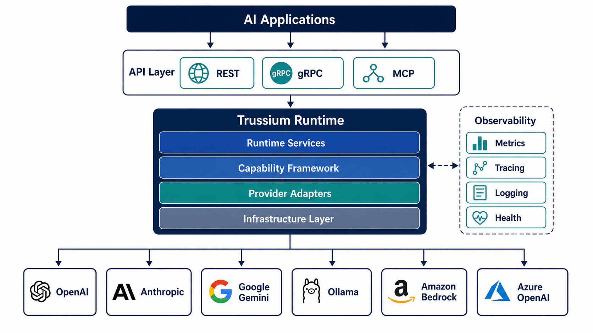
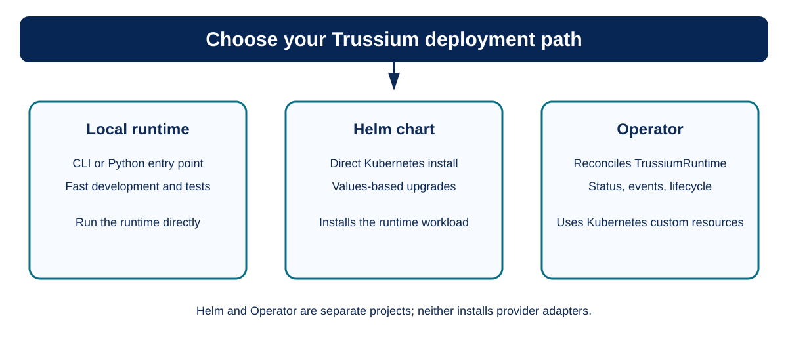
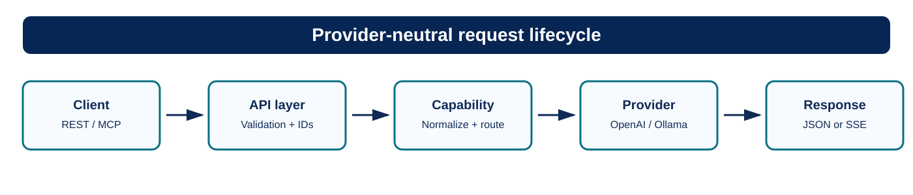

# Trussium

{ width="156" }

## Cloud-native runtime for AI applications

Trussium is a provider-neutral runtime for operating AI capabilities across
hosted providers and private models. It gives applications one HTTP API and
one operational contract while allowing providers, models, and deployment
environments to change independently.

The runtime is designed for teams that need normalized capability responses,
request correlation, streaming support, health and readiness checks, metrics,
tracing, structured logs, and bounded shutdown behavior.

*Conceptual architecture: provider logos represent adapter examples; the
runtime does not install or require every provider shown.*

## Deployment and request flows

Choose the deployment model that matches your operating needs:

Every integration follows the same provider-neutral request lifecycle:

## Project components

### Runtime

The [Trussium runtime](https://github.com/trussiumhq/trussium) provides the
core execution platform, including capability contracts, provider integration,
health endpoints, metrics, tracing, and structured operational logging.

### Kubernetes Operator

The [Trussium Operator](https://github.com/trussiumhq/trussium-operator)
manages `TrussiumRuntime` resources through a Kubernetes-native reconciliation
loop, including runtime configuration, deployment lifecycle, status, events,
and upgrades.

### Helm chart

The [official Helm chart](https://github.com/trussiumhq/trussium-helm)
packages the runtime for configurable Kubernetes installation, upgrade, and
operational deployment.

The chart installs the runtime workload. It does not install the Kubernetes
Operator; the Operator is a separate project for teams that want
`TrussiumRuntime` custom resources and reconciliation.

### trussiumctl CLI

The [trussiumctl CLI](https://github.com/trussiumhq/trussiumctl) is a
standalone Go binary for read-only inspection and guarded Kubernetes and Helm
operations. It discovers deployed component versions for diagnostics and
upgrade preflights, requires explicit confirmation for mutations, validates
manifests server-side, and verifies completed operations.

### Knowledge Agent reference application

The [Trussium Knowledge Agent](https://github.com/trussiumhq/trussium-knowledge-agent)
is a Python reference application for Markdown knowledge search and
documentation maintenance. It can index an explicitly selected local Markdown
repository, send chunks to a configured Trussium runtime for embeddings, and
run bounded semantic search over pgvector. Its `ask` command sends retrieved
passages to a configured Trussium chat model and returns an answer only when
its citation IDs map to retrieved source paths and headings; missing or invalid
evidence produces an insufficient-evidence response. A browser interface is
available as a local reference UI, while the bounded documentation-audit
workflow is being integrated across the runtime, Python SDK, and Knowledge
Agent. See the public [agent workflow guide](agent-workflows.md) for the
composition and current implementation issues, and the
[repository roadmap](https://github.com/trussiumhq/trussium-knowledge-agent/blob/main/docs/ROADMAP.md)
for current status and the canonical setup instructions. The repository also
includes a small retrieval-evaluation corpus and an `evaluate` CLI command that
reports Hit@k, Recall@k, MRR@k, and expected versus retrieved source citations.
These metrics assess retrieval and citation coverage only; they do not prove
that a generated answer is factually correct. See the
[evaluation guide](https://github.com/trussiumhq/trussium-knowledge-agent/blob/main/docs/EVALUATION.md)
for setup and interpretation. The app also provides a local browser interface
that displays citation-validated answers, source paths and headings, and a
clear insufficient-evidence state. It is a reference UI, not an authenticated
multi-user service; see the
[browser-interface guide](https://github.com/trussiumhq/trussium-knowledge-agent/blob/main/docs/WEB_INTERFACE.md)
for its API, setup, and deployment boundary.

## Choose a starting point

Use the **Task guides** section in the navigation for a direct path through a
common workflow. The links below provide the same entry points with context:

- **Run locally:** start with the runtime [CLI](runtime/CLI.md) and
  [API usage](runtime/API_USAGE.md) guides.
- **Run privately:** follow [self-hosting](runtime/SELF_HOSTING.md), then
  review [provider configuration](runtime/PROVIDER_DEVELOPMENT.md).
- **Deploy to Kubernetes:** use the [Helm chart](helm/chart.md) for a direct
  runtime deployment, or the [Operator overview](operator/index.md) for
  reconciled custom resources.
- **Operate in production:** review [health and readiness](runtime/HEALTH.md),
  [metrics](runtime/METRICS.md), [tracing](runtime/TRACING.md), and
  [shutdown behavior](runtime/SHUTDOWN.md).

## Current release baseline

The public components are independently versioned. The current baseline is:

- [Trussium runtime v1.29.1](https://github.com/trussiumhq/trussium/releases/tag/v1.29.1)
- [Trussium Helm chart v1.3.1](https://github.com/trussiumhq/trussium-helm/releases/tag/v1.3.1)
- [Trussium Operator v1.0.5](https://github.com/trussiumhq/trussium-operator/releases/tag/v1.0.5)
- [trussiumctl CLI v1.16.0](https://github.com/trussiumhq/trussiumctl/releases/tag/v1.16.0)

The runtime, chart, operator, and CLI remain independently versioned components;
SDKs and provider adapters are optional integrations. The runtime’s bounded MCP
tool-execution surface, including the bounded `ping` handshake, declared tool
input schemas, cursor pagination, lifecycle notifications, and explicit tool
success status, is included in the v1.27 release line and is documented
in the Runtime capabilities section. The
[Operator compatibility matrix](operator/COMPATIBILITY.md) records runtime
`v1.27.0` and `v1.29.1` as tested with Operator v1.0.5. The
Runtime Helm chart v1.3.1 still defaults to runtime `1.27.0`; the Operator
validation selects `1.29.1` explicitly, so the chart default has not changed.

## Project status

The public roadmap and architecture decisions describe the supported contracts
and their maturity. Start with the [runtime roadmap](runtime/ROADMAP.md), then
consult the relevant component's release and compatibility guidance before
upgrading.

## Documentation

Use the navigation to access runtime, operator, Helm, and CLI documentation.
Each section covers public contracts, deployment guidance, operational behavior,
and architecture decisions. Contributions and documentation corrections are
welcome through the [contributing guide](contributing.md).
